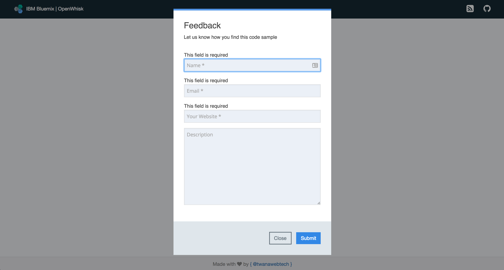
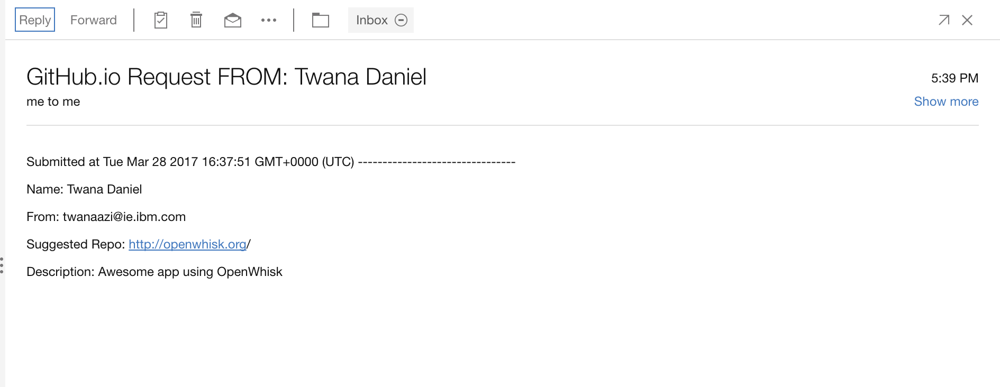
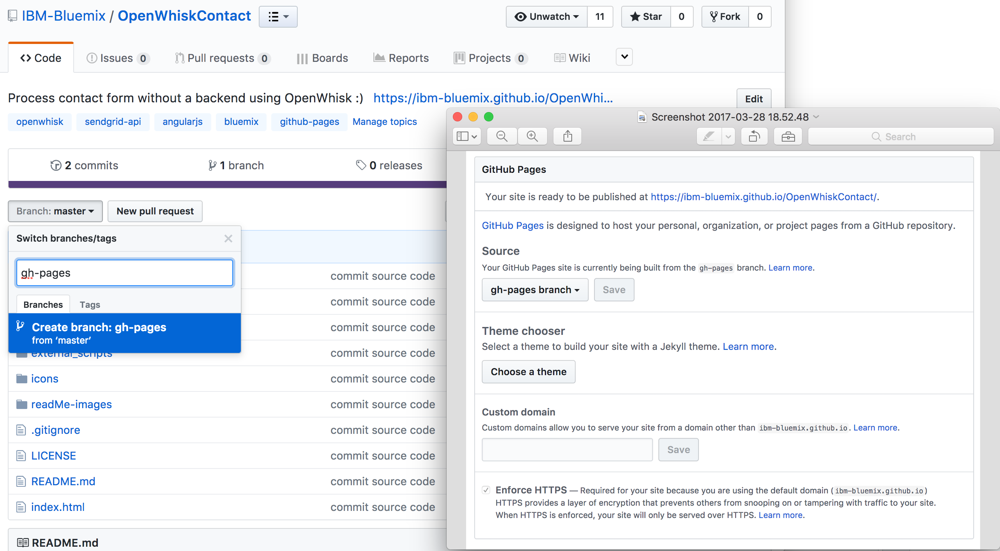

# Process forms with IBM Bluemix OpenWhisk

The OpenWhiskContact application is a simple Angular.js form processing app that shows how a form can be processed without the need of any backend, this is by using the [IBM OpenWhisk](http://openwhisk.org/) Serverless architecture where an action is created then exposed as an API and then used in the Angular app.

The Angular app has some cool features out of the box, things like popups, messages, and validations, all in which can be reused. The Angular app is responsible for taken the user data, then make a POST request to the OpenWhisk API on Bluemix.

On the other side, OpenWhisk action is created to handle the request and process the form by using SendGrid email client to send the emails, this shows how easily actions can be created and used. 
  


See live running link here: [https://ibm-bluemix.github.io/OpenWhiskContact/](https://ibm-bluemix.github.io/OpenWhiskContact/)

For many JavaScript heavy applications, OpenWhisk can be super efficient and beneficial to use for many reasons, a good example of this would be the [IBM-Bluemix GitHub.io](https://ibm-bluemix.github.io/) page, the [IBM-Bluemix GitHub.io](https://ibm-bluemix.github.io/) page is a simple Angular app hosted on GitHub where there is no backend, in such case OpenWhisk can be super handy when needing to process forms and other backend processing. instead of having the backend running at all time for just processing some forms when needed, with OpenWhisk the action is only fired when needs to be fired, this means that we don't need the backend to run when it shouldn't, this can save both costing and overhead of server management. 

_Note: the [IBM-Bluemix GitHub.io](https://ibm-bluemix.github.io/) site is a well-maintained, centralized, curated collection of open sample applications built using Bluemix and Bluemix services.
The source code for this example is taken from the [IBM-Bluemix GitHub.io](https://ibm-bluemix.github.io/) page, be sure to check it out for finding great featured samples._


Built using the IBM Bluemix, the application uses:
- IBM Bluemix OpenWhisk to host the API 
- Angulrs.js for frontend  
- SendGrid mail client  

**No runtime to deploy, no server to manage**
   


## Application Requirements
- IBM Bluemix account. [Sign up](https://console.ng.bluemix.net/registration/?target=%2Fdashboard%2Fapps) for Bluemix, or use an existing account.
- [SendGrid](https://sendgrid.com/) email client, sign up for free and get your token  
- GitHub Pages to host the frontend

## Running the app on top of GitHub Pages and OpenWhisk

  1. Clone or fork the repository 

  2. Check out the code

  3. Ensure your [OpenWhisk command line interface](https://console.ng.bluemix.net/openwhisk/cli) is properly configured with:

  ```
  wsk list
  ```

  This shows the packages, actions, triggers and rules currently deployed in your OpenWhisk namespace.
  
  
  4. Create an Email API using [SendGrid](https://sendgrid.com/) or any other mail client, using [SendGrid](https://sendgrid.com/) you can get free API to send up to 40k emails.
  5. Edit the OpenWhiskAction/action.js file, add your SendGrid API key and your email address to which you want to receive the emails. Save the file, next we will create the OpenWhisk Action.
      ```
      let SG_KEY = 'ADD SendGrid API Here'; //SendGrid API Key
      let to_email = new helper.Email('your-email@gmail.com'); //Add your email here
      ```
  6. Navigate into OpenWhiskAction folder
      ```
        $ cd OpenWhiskAction
      ```
  7. Create an action called mailAction from the action.js source file
      ```
        $ wsk action create OpenWhiskContact action.js
      ```      
  8. Expose the action created "mailAction" as an API and keep note of the API endpoint you get in the terminal 
      ```
        $ wsk api-experimental create /OpenWhiskContact /api/v1 post OpenWhiskContact --annotation web-export true
      ``` 
  9. Add your OpenWhisk API from step 8 to the requestController.js file located in /app/controllers/requestController.js
      ```
         var API_URL = 'Your OpenWhisk API';
      ``` 
      Here is an example of a OpenWhisk API: `https://b4651037-d05a-4b7d-ab46-1e9a1abc096f-gws.api-gw.mybluemix.net/OpenWhiskContact/api/v1`
    
  10. Done, with that in place, you should be ready to go to host the code on GitHub.
  11. Commit the code to GitHub
  12. Create a new branch called gh-pages, GitHub will enable GitHub Pages when "gh-pages" branch is created with all the code.
       
  
   **Done, see the running application on GitHub:**  
   [https://ibm-bluemix.github.io/OpenWhiskContact/](https://ibm-bluemix.github.io/OpenWhiskContact/)

## Useful OpenWhisk Commands
| Commands | Description |
| ---- | ----------- |
|$ wsk --help| Wsk help to find available commands |
|$ wsk activation poll| Useful for troubleshooting to view logs and errors  |
|$ wsk action create 'Action_Name' 'Action_File'| To create OpenWhisk action |
|$ wsk action list| list all OpenWhisk actions |
|$ wsk api-experimental create /'Api_Name' /'Api_Path' post 'Action_Name'| Expose action as a API  |
|$ wsk api-experimental list| List all API's |


## Code Structure

| Source Files | Description |
| ---- | ----------- |
|[**action.js**](OpenWhiskAction/action.js)| Create OpenWhisk using SendGrid |
|[**requestController.js**](app/controllers/requestController.js)| Angular controller, making a post request to the OpenWhisk endpoint api, passing all the form data. |
|[**app.js**](app/app.js)| Angular entry point, loading angular modules {ui.bootstrap} {ui.bootstrap.modal} {ngSanitize} {ngDialog} {ngMessages} |


## License

See [LICENSE](LICENSE) for license information.

---

This project is a sample application created for the purpose of demonstrating a serverless app with OpenWhisk. The program is provided as-is with no warranties of any kind, express or implied.

[bluemix_signup_url]: https://console.ng.bluemix.net/?cm_mmc=GitHubReadMe